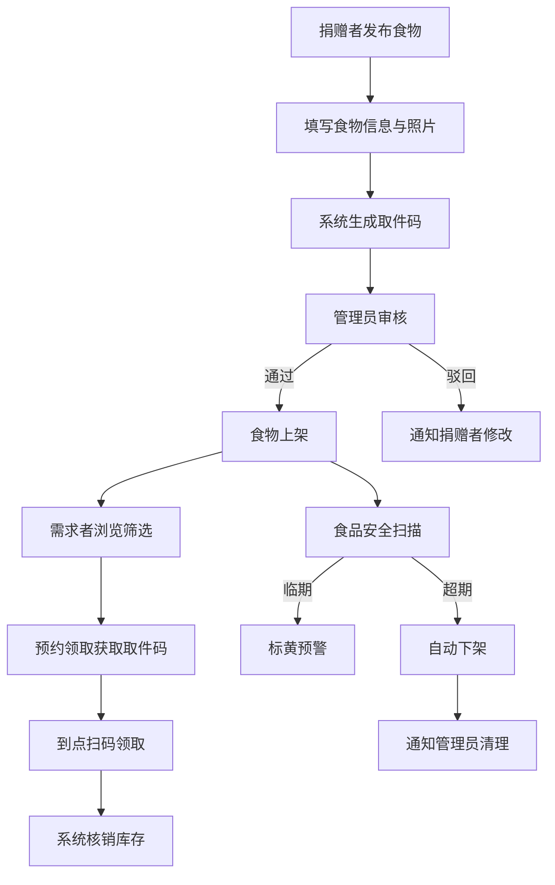

## 1. 产品概述

社区食物银行与共享冰箱管理平台，连接社区内的食物捐赠者、需求者和管理员，围绕共享冰箱或食物银行实现多余食物的快速流转与减少浪费。通过智能化的取件码系统、食品安全预警机制和数据驱动的社区看板，打造高效透明的社区食物共享生态。

- 目标用户：社区中有余食可捐赠的居民/商户、需要食物援助的家庭/个人、食物银行/共享冰箱的管理员
- 核心价值：减少食物浪费、帮扶困难群体、促进社区互助、量化社会影响力

## 2. 核心功能

### 2.1 用户角色

| 角色 | 注册方式 | 核心权限 |
|------|----------|----------|
| 捐赠者 | 手机号/邮箱注册 | 发布食物捐赠、查看捐赠记录、查看取件码 |
| 需求者 | 手机号/邮箱注册 | 浏览在架食物、预约领取、扫码核销 |
| 管理员 | 后台指派 | 审核食物上架、巡查冰箱状态、处理过期食物、查看数据看板 |

### 2.2 功能模块

1. **首页/食物浏览页**：食物分类筛选、搜索、距离排序、保质期筛选、食物卡片展示
2. **食物发布页**：捐赠者填写食物信息、上传照片、选择取餐方式、生成取件码
3. **食物详情页**：食物详细信息、取件码展示、预约领取、位置导航
4. **个人中心页**：角色切换、我的捐赠/领取记录、取件码管理
5. **管理员工作台**：待审核列表、冰箱状态巡查、过期食物处理、食物上下架
6. **社区数据看板**：流转总量、受益家庭数、减碳量估算、热门捐赠者排行、冰箱库存状态

### 2.3 页面详情

| 页面名称 | 模块名称 | 功能描述 |
|----------|----------|----------|
| 首页 | 食物分类导航 | 生鲜果蔬/熟食/干货/罐头/烘焙/冷冻食品六大分类快速筛选 |
| 首页 | 搜索与筛选栏 | 关键词搜索、距离筛选、保质期筛选、取餐方式筛选 |
| 首页 | 食物卡片列表 | 展示食物名称、类别标签、保质期、取餐方式、距离、临期/超期标识 |
| 首页 | 食物安全横幅 | 临期预警提示、超期自动下架通知 |
| 食物发布页 | 基本信息表单 | 食物名称、类别选择、数量/重量、保质期限 |
| 食物发布页 | 取餐方式选择 | 放置共享冰箱/定点自取/上门领取三种方式 |
| 食物发布页 | 照片上传 | 支持上传实物照片，最多3张 |
| 食物发布页 | 取件码生成 | 提交后自动生成唯一取件码，支持二维码展示 |
| 食物详情页 | 食物信息展示 | 完整食物信息、照片轮播、取件码/二维码 |
| 食物详情页 | 预约领取 | 需求者点击预约，获取取件码，显示领取地点和时间 |
| 食物详情页 | 扫码核销 | 领取后扫码确认，自动核销库存 |
| 个人中心 | 角色身份 | 显示当前角色，支持切换捐赠者/需求者视角 |
| 个人中心 | 捐赠记录 | 捐赠者查看历史捐赠、状态追踪 |
| 个人中心 | 领取记录 | 需求者查看历史领取、取件码历史 |
| 管理员工作台 | 待审核列表 | 新上架食物审核，通过/驳回 |
| 管理员工作台 | 冰箱状态巡查 | 各共享冰箱温度、清洁度、食物存量 |
| 管理员工作台 | 过期食物处理 | 标记变质、下架过期食物、通知清理 |
| 管理员工作台 | 每日统计 | 投放量、领取量、损耗量记录 |
| 社区数据看板 | 流转总量 | 当月食物投放/领取/损耗总量图表 |
| 社区数据看板 | 受益家庭数 | 当月受益家庭/个人统计 |
| 社区数据看板 | 减碳量估算 | 基于节约食物量估算减少的碳排放 |
| 社区数据看板 | 捐赠者排行 | 热门捐赠者TOP排行 |
| 社区数据看板 | 冰箱库存状态 | 各共享冰箱实时库存可视化 |

## 3. 核心流程

**食物捐赠与领取流程**：捐赠者在平台发布食物信息 → 填写名称、类别、数量、保质期、取餐方式并上传照片 → 系统生成唯一取件码 → 管理员审核通过后上架 → 需求者浏览在架食物 → 按类别/距离/保质期筛选 → 预约领取获取取件码 → 到指定冰箱或取餐点扫码领取 → 系统自动核销库存

**食品安全预警流程**：系统定时扫描在架食物 → 距保质期不足2天的食物标黄预警 → 超过保质期的食物自动下架 → 通知管理员前往清理

## 4. 用户界面设计

### 4.1 设计风格

- 主色调：温暖的橙色系 (#F97316) 象征食物与温暖，辅色为深绿色 (#16A34A) 象征环保与新鲜
- 警告色：琥珀色 (#F59E0B) 用于临期预警，红色 (#EF4444) 用于过期/下架
- 按钮风格：圆角按钮 (rounded-xl)，主按钮实色填充，次按钮描边风格
- 字体：标题使用 Noto Sans SC Bold，正文使用 Noto Sans SC Regular
- 布局风格：卡片式布局，顶部导航栏，侧边可折叠筛选面板
- 图标风格：使用 Lucide Icons 线性图标，保持简洁统一

### 4.2 页面设计概览

| 页面名称 | 模块名称 | UI元素 |
|----------|----------|--------|
| 首页 | 顶部导航 | Logo、搜索框、角色切换、通知铃铛 |
| 首页 | 分类导航 | 六大分类水平滚动图标卡片，选中态高亮 |
| 首页 | 食物卡片 | 圆角卡片、食物缩略图、类别标签色块、保质期倒计时、距离标签、临期黄色边框闪烁 |
| 首页 | 筛选面板 | 侧边栏滑出，多选分类、距离滑块、保质期范围选择 |
| 食物发布页 | 表单 | 分步表单，步骤指示器，大号输入框，图片拖拽上传区域 |
| 食物发布页 | 取件码 | 成功页大号取件码数字+二维码，复制/分享按钮 |
| 食物详情页 | 信息区 | 顶部照片轮播、信息卡片、取餐方式标签、地图定位 |
| 食物详情页 | 预约按钮 | 底部固定预约栏，渐变色按钮 |
| 个人中心 | 头像区 | 头像、昵称、角色标签、统计数据概览 |
| 个人中心 | 记录列表 | 时间线样式，状态标签（待审核/进行中/已完成） |
| 管理员工作台 | 审核卡片 | 左侧食物缩略图，右侧信息+审核操作按钮 |
| 管理员工作台 | 冰箱状态 | 卡片网格，温度指示器，存量进度条，清洁度星级 |
| 社区数据看板 | 数据卡片 | 大号数字+趋势图标，渐变背景色块 |
| 社区数据看板 | 图表区 | 柱状图/折线图展示流转趋势，圆环图展示分类占比 |
| 社区数据看板 | 排行榜 | 头像列表，排名奖牌图标，捐赠数量 |

### 4.3 响应式设计

- 桌面优先设计，大屏(≥1280px)三列卡片网格，中屏(768-1279px)两列，小屏(<768px)单列
- 导航栏在移动端转为底部Tab栏
- 筛选面板在移动端以全屏弹窗形式展示
- 数据看板图表自适应容器宽度

### 4.4 动效设计

- 食物卡片进入视口时使用交错动画(stagger)渐显
- 取件码生成时有翻转/弹跳动画
- 临期食物卡片边框使用脉冲动画
- 页面切换使用淡入淡出过渡
- 数据看板数字使用滚动递增动画
