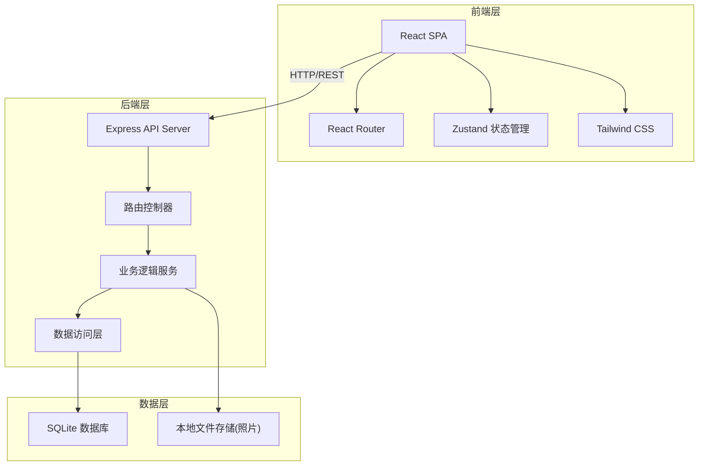
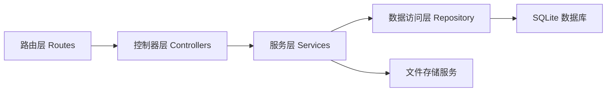
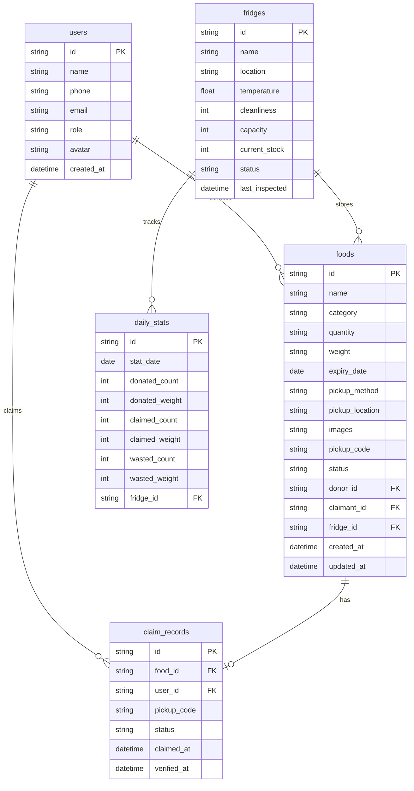

## 1. 架构设计



## 2. 技术说明

- 前端：React@18 + TypeScript + Tailwind CSS@3 + Vite
- 初始化工具：vite-init
- 后端：Express@4 + TypeScript (ESM)
- 数据库：SQLite (better-sqlite3)，适合轻量级部署场景
- 状态管理：Zustand
- 图表库：Recharts
- 图标库：lucide-react

## 3. 路由定义

| 路由 | 用途 |
|------|------|
| / | 首页 - 食物浏览与筛选 |
| /food/:id | 食物详情页 |
| /donate | 食物发布页(捐赠者) |
| /profile | 个人中心 |
| /admin | 管理员工作台 |
| /dashboard | 社区数据看板 |

## 4. API 定义

### 4.1 食物相关

```typescript
interface FoodItem {
  id: string
  name: string
  category: "生鲜果蔬" | "熟食" | "干货" | "罐头" | "烘焙" | "冷冻食品"
  quantity: string
  weight?: string
  expiryDate: string
  pickupMethod: "放置共享冰箱" | "定点自取" | "上门领取"
  pickupLocation: string
  images: string[]
  pickupCode: string
  status: "pending_review" | "available" | "reserved" | "claimed" | "expired" | "rejected"
  donorId: string
  claimantId?: string
  fridgeId?: string
  createdAt: string
  updatedAt: string
}

// GET /api/foods - 获取在架食物列表(支持筛选)
interface GetFoodsQuery {
  category?: string
  pickupMethod?: string
  expiryBefore?: string
  keyword?: string
  sortBy?: "distance" | "expiry" | "createdAt"
  page?: number
  limit?: number
}

// POST /api/foods - 发布食物捐赠
interface CreateFoodBody {
  name: string
  category: string
  quantity: string
  weight?: string
  expiryDate: string
  pickupMethod: string
  pickupLocation: string
  images: string[]
}

// GET /api/foods/:id - 获取食物详情
// PUT /api/foods/:id/status - 更新食物状态(审核/预约/核销)
interface UpdateFoodStatusBody {
  status: "approved" | "rejected" | "reserved" | "claimed" | "expired"
  claimantId?: string
}

// POST /api/foods/:id/claim - 预约领取食物
interface ClaimFoodBody {
  claimantId: string
}
```

### 4.2 用户相关

```typescript
interface User {
  id: string
  name: string
  phone: string
  email: string
  role: "donor" | "claimant" | "admin"
  avatar?: string
  createdAt: string
}

// POST /api/auth/login - 用户登录
// GET /api/users/:id - 获取用户信息
// GET /api/users/:id/donations - 获取捐赠记录
// GET /api/users/:id/claims - 获取领取记录
```

### 4.3 冰箱相关

```typescript
interface Fridge {
  id: string
  name: string
  location: string
  temperature: number
  cleanliness: 1 | 2 | 3 | 4 | 5
  capacity: number
  currentStock: number
  status: "normal" | "warning" | "maintenance"
  lastInspected: string
}

// GET /api/fridges - 获取所有冰箱状态
// PUT /api/fridges/:id - 更新冰箱状态
// GET /api/fridges/:id/foods - 获取冰箱内食物列表
```

### 4.4 数据统计

```typescript
interface DashboardStats {
  totalDonated: number
  totalClaimed: number
  totalWasted: number
  benefitedFamilies: number
  carbonReduction: number
  topDonors: Array<{ id: string; name: string; avatar?: string; donationCount: number }>
  fridgeStatus: Array<Fridge>
  monthlyTrend: Array<{ month: string; donated: number; claimed: number; wasted: number }>
  categoryBreakdown: Array<{ category: string; count: number }>
}

// GET /api/dashboard - 获取看板统计数据
```

### 4.5 系统相关

```typescript
// POST /api/upload - 上传图片
// GET /api/system/alerts - 获取食品安全预警列表
```

## 5. 服务端架构图



## 6. 数据模型

### 6.1 数据模型定义



### 6.2 数据定义语言

```sql
CREATE TABLE users (
  id TEXT PRIMARY KEY,
  name TEXT NOT NULL,
  phone TEXT NOT NULL UNIQUE,
  email TEXT,
  role TEXT NOT NULL CHECK(role IN ('donor', 'claimant', 'admin')),
  avatar TEXT,
  created_at TEXT NOT NULL DEFAULT (datetime('now'))
);

CREATE TABLE fridges (
  id TEXT PRIMARY KEY,
  name TEXT NOT NULL,
  location TEXT NOT NULL,
  temperature REAL NOT NULL DEFAULT 4.0,
  cleanliness INTEGER NOT NULL DEFAULT 5 CHECK(cleanliness BETWEEN 1 AND 5),
  capacity INTEGER NOT NULL DEFAULT 50,
  current_stock INTEGER NOT NULL DEFAULT 0,
  status TEXT NOT NULL DEFAULT 'normal' CHECK(status IN ('normal', 'warning', 'maintenance')),
  last_inspected TEXT NOT NULL DEFAULT (datetime('now'))
);

CREATE TABLE foods (
  id TEXT PRIMARY KEY,
  name TEXT NOT NULL,
  category TEXT NOT NULL CHECK(category IN ('生鲜果蔬', '熟食', '干货', '罐头', '烘焙', '冷冻食品')),
  quantity TEXT NOT NULL,
  weight TEXT,
  expiry_date TEXT NOT NULL,
  pickup_method TEXT NOT NULL CHECK(pickup_method IN ('放置共享冰箱', '定点自取', '上门领取')),
  pickup_location TEXT NOT NULL,
  images TEXT NOT NULL DEFAULT '[]',
  pickup_code TEXT NOT NULL UNIQUE,
  status TEXT NOT NULL DEFAULT 'pending_review' CHECK(status IN ('pending_review', 'available', 'reserved', 'claimed', 'expired', 'rejected')),
  donor_id TEXT NOT NULL REFERENCES users(id),
  claimant_id TEXT REFERENCES users(id),
  fridge_id TEXT REFERENCES fridges(id),
  created_at TEXT NOT NULL DEFAULT (datetime('now')),
  updated_at TEXT NOT NULL DEFAULT (datetime('now'))
);

CREATE TABLE claim_records (
  id TEXT PRIMARY KEY,
  food_id TEXT NOT NULL REFERENCES foods(id),
  user_id TEXT NOT NULL REFERENCES users(id),
  pickup_code TEXT NOT NULL,
  status TEXT NOT NULL DEFAULT 'pending' CHECK(status IN ('pending', 'verified', 'cancelled')),
  claimed_at TEXT NOT NULL DEFAULT (datetime('now')),
  verified_at TEXT
);

CREATE TABLE daily_stats (
  id TEXT PRIMARY KEY,
  stat_date TEXT NOT NULL,
  donated_count INTEGER NOT NULL DEFAULT 0,
  donated_weight REAL NOT NULL DEFAULT 0,
  claimed_count INTEGER NOT NULL DEFAULT 0,
  claimed_weight REAL NOT NULL DEFAULT 0,
  wasted_count INTEGER NOT NULL DEFAULT 0,
  wasted_weight REAL NOT NULL DEFAULT 0,
  fridge_id TEXT REFERENCES fridges(id),
  UNIQUE(stat_date, fridge_id)
);

CREATE INDEX idx_foods_status ON foods(status);
CREATE INDEX idx_foods_category ON foods(category);
CREATE INDEX idx_foods_donor ON foods(donor_id);
CREATE INDEX idx_foods_expiry ON foods(expiry_date);
CREATE INDEX idx_claim_records_user ON claim_records(user_id);
CREATE INDEX idx_claim_records_food ON claim_records(food_id);
```
